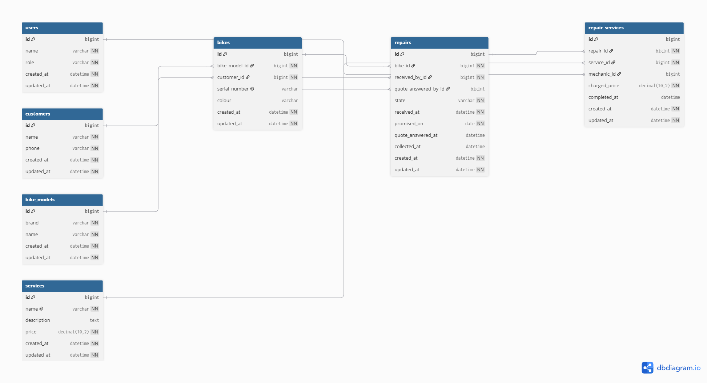

# Domain model



```dbml
Table customers {
  id bigint [pk]
  name varchar [not null]
  phone varchar [not null]
  created_at datetime [not null]
  updated_at datetime [not null]
}

Table users {
  id bigint [pk]
  name varchar [not null]
  role varchar [not null]
  created_at datetime [not null]
  updated_at datetime [not null]
}

Table bike_models {
  id bigint [pk]
  brand varchar [not null]
  name varchar [not null]
  created_at datetime [not null]
  updated_at datetime [not null]
}

Table services {
  id bigint [pk]
  name varchar [not null, unique]
  description text
  price decimal(10,2) [not null]
  created_at datetime [not null]
  updated_at datetime [not null]
}

Table bikes {
  id bigint [pk]
  bike_model_id bigint [not null, ref: > bike_models.id]
  customer_id bigint [not null, ref: > customers.id]
  serial_number varchar [unique]
  colour varchar
  created_at datetime [not null]
  updated_at datetime [not null]
}

Table repairs {
  id bigint [pk]
  bike_id bigint [not null, ref: > bikes.id]
  received_by_id bigint [not null, ref: > users.id]
  quote_answered_by_id bigint [ref: > users.id]
  state varchar [not null, default: 'received']
  received_at datetime [not null]
  promised_on date [not null]
  quote_answered_at datetime
  collected_at datetime
  created_at datetime [not null]
  updated_at datetime [not null]
}

Table repair_services {
  id bigint [pk]
  repair_id bigint [not null, ref: > repairs.id]
  service_id bigint [not null, ref: > services.id]
  mechanic_id bigint [ref: > users.id]
  charged_price decimal(10,2) [not null]
  completed_at datetime
  created_at datetime [not null]
  updated_at datetime [not null]
}
```

The `ref` lines are drawn in the diagram because the relationships are real. They are **not**
foreign key constraints in the database: today the `_id` columns are plain columns with an index on
them, and the constraint arrives in Lab 7 together with the association in Ruby that uses it.

## Changes since Lab 3

Nine differences between the diagram submitted in Lab 3 and the schema built today.

| Change | Why |
|---|---|
| Table `repair_photos` **removed** | Photos arrive in Lab 9 and bring their own table. The lab forbids a column or table for them today |
| `repairs.diagnosis` **removed** | Same reason: the written diagnosis is Lab 9 |
| `bikes.colour` **added** | Two bikes have to be the same make, model and colour and differ only in their serial number. Without the column the March mix-up cannot be represented at all |
| `repairs.collected_at` **added** | A repair that has not been handed back has to be distinguishable from one that has. The state says which, but the moment it left is a fact worth keeping |
| `services.description` **added** | The public price list says what each job covers, which is the whole point of putting the wall list on the site (US-14) |
| `state` and `role`: `enum` → `varchar` | The state is now a `varchar` column with `default: 'received'`, the first state of the lifecycle. The values are the state names from this document, spelled identically |
| `integer` → `bigint` on every key | It is the type Rails gives `id` and every `_id` column, and this document has to describe the schema that exists |
| `created_at` and `updated_at` **added to every table** | Rails maintains them, and they are the cheapest audit trail there is |
| **No foreign key constraints** | The `_id` columns point at another table but the database does not check it today. The constraint is Lab 7 |

The seven tables are unchanged in name and meaning. Nothing was renamed.

## The lifecycle of a repair

A repair is in exactly one of seven states at a time: `received`, `quoted`, `approved`,
`declined`, `in_progress`, `ready`, `collected`. It enters at `received` when the bike arrives and
leaves at `collected` when the bike does.

`received` is the default on the column, so a repair inserted without a state starts there.

### Allowed

| From | To | What happened |
|---|---|---|
| `received` | `quoted` | the mechanic looked at it properly and added the services it needs |
| `received` | `in_progress` | *"sometimes it is a flat tyre and it goes out the same afternoon"* — nobody phones a customer to price a flat tyre |
| `quoted` | `approved` | the counter recorded the customer's yes |
| `quoted` | `declined` | the counter recorded the customer's no |
| `approved` | `in_progress` | a mechanic picked it up |
| `in_progress` | `ready` | every `repair_service` on it has a `completed_at` |
| `ready` | `collected` | the bike left with its owner |
| `declined` | `collected` | *"some say no and come to pick it up the way it arrived"* |

### Not allowed

| Refused | Why |
|---|---|
| `quoted` → `in_progress` | *"wait for them to say yes before we touch it"*. This is the rule the quoting step exists to enforce. |
| `declined` → `in_progress` | Work after a no is work nobody agreed to pay for. |
| `received` → `ready` | A repair never worked on cannot be finished. If nothing was wrong, it is `declined`. |
| `in_progress` → `ready` with an unfinished `repair_service` | "Ready" means the bike can leave, and it cannot leave with a service still open. |
| `collected` → anything | The bike is gone. A bike that comes back is a new repair on the same bike. |

Nothing in the database enforces these transitions today. The column accepts any string; what keeps
the data honest is the seed file and, from Lab 7, the model.

There is no `overdue` state. Nobody moves a repair into it — the calendar does, at midnight. It is
a question asked of a repair, not a state it is in, and it is answered below.

## Every entity traces back to a story

| Entity | The story that requires it |
|---|---|
| `customers` | **US-01** — *"we write their name and phone on a paper tag"* |
| `bikes` | **US-01**, and **US-10**, which forces the bike to exist apart from its owner |
| `bike_models` | **US-01** — *"a Trek Marlin, a Giant Escape"* |
| `users` | **US-07** — a mechanic cannot see *their* repairs unless the system tells mechanics apart |
| `repairs` | **US-01**, and every story from US-03 to US-13 |
| `services` | **US-14**, the public wall list, and **US-08**, which puts lines on a repair |
| `repair_services` | **US-08** and **US-13**; the discount has nowhere else to live |

`repair_photos` is gone from this table because the table is gone from the schema. US-02 still
exists and is still unbuilt; it comes back in Lab 9.

## Two decisions defended

### The thing, and the copy of the thing

"Trek Marlin" is a **model** — a name you could print on a list. The object on the rack is a
**bike**, and after March the shop knows those are not the same thing. So `bike_models` holds the
model and `bikes` holds one row per physical bicycle with its own serial number, its own colour and
its own owner; `repairs.bike_id` points at the bike, and there is no way in this schema to record a
repair against "a Trek Marlin". A single table with a `quantity` column — *two Marlins in the shop
this week* — answers *how many* and nothing else: not which one is Juan's, not which serial is on
the one that is ready, not which of them had its fork replaced last year, and not which one to hand
to the person standing at the counter. The count was never the thing worth storing. The individual
bicycle was, because the individual bicycle is the thing that has a history.

The seed file contains that exact pair: two Trek Marlin 5, both blue, `WTU123456A` and
`WTU987654B`, owned by different people and with different repair histories. The unique index on
`serial_number` is what makes them impossible to confuse.

### Derived, or stored?

**Not stored: whether a repair is late.** The shop cares about it as much as anything — *"if I
said Thursday and it is Friday afternoon, I want to see that on the screen"* — and it still gets
no column. It is obtained by computing `promised_on < today AND state <> 'collected'` from two
fields already in `repairs`, because lateness depends on nothing that *happened*: it depends on
today's date. A stored boolean would be correct when written and wrong the next midnight, and
keeping it right would mean a nightly pass over every open repair to reproduce a comparison that
costs nothing — with the added risk of contradicting `promised_on` on the same screen.

**Stored anyway: `repair_services.charged_price`.** It looks derivable — it is on the wall, it is
`services.price` — but *"the list goes up every January"* and *"last year's invoices cannot change
in January because the list changed"*. Had it not been stored, every past repair would silently
re-price itself on the first of January and a customer holding a November invoice would see a
different number than the shop; and *"sometimes we charge less than the list says, because it is a
regular"* would be unrecordable, since a discount is derivable from nothing at all. It is not a
cache of `services.price`; it is what this shop charged, which merely happens to equal the list
price most of the time.

The seed file makes both cases visible: a repair from more than a year ago whose charged prices are
below today's list, and a discount granted on a single line of a single repair.