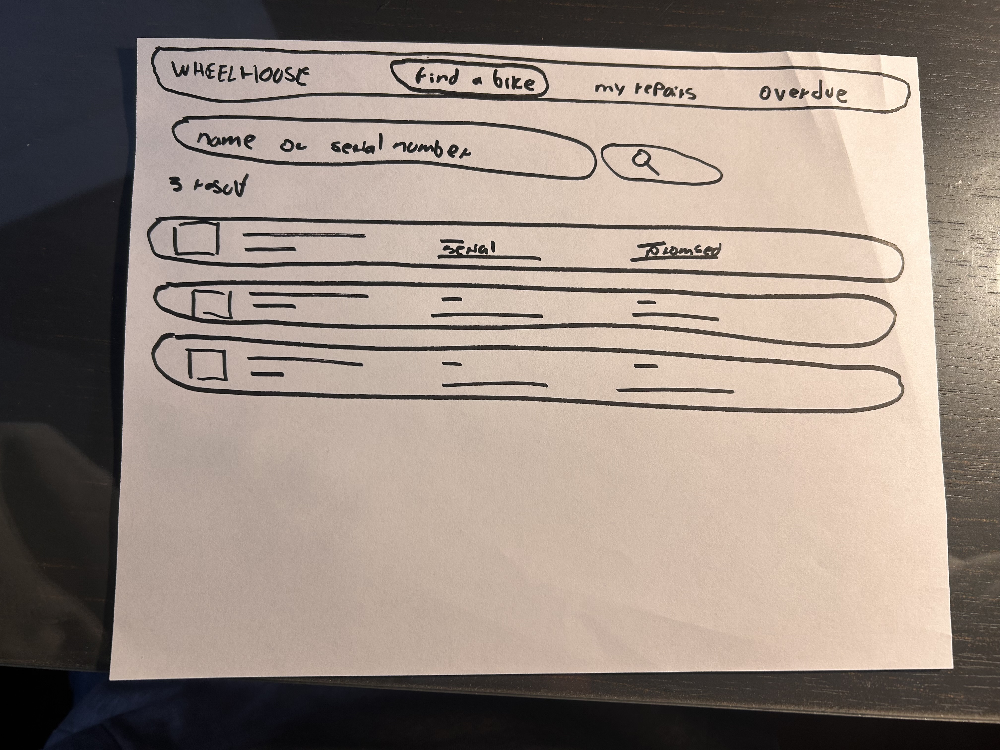
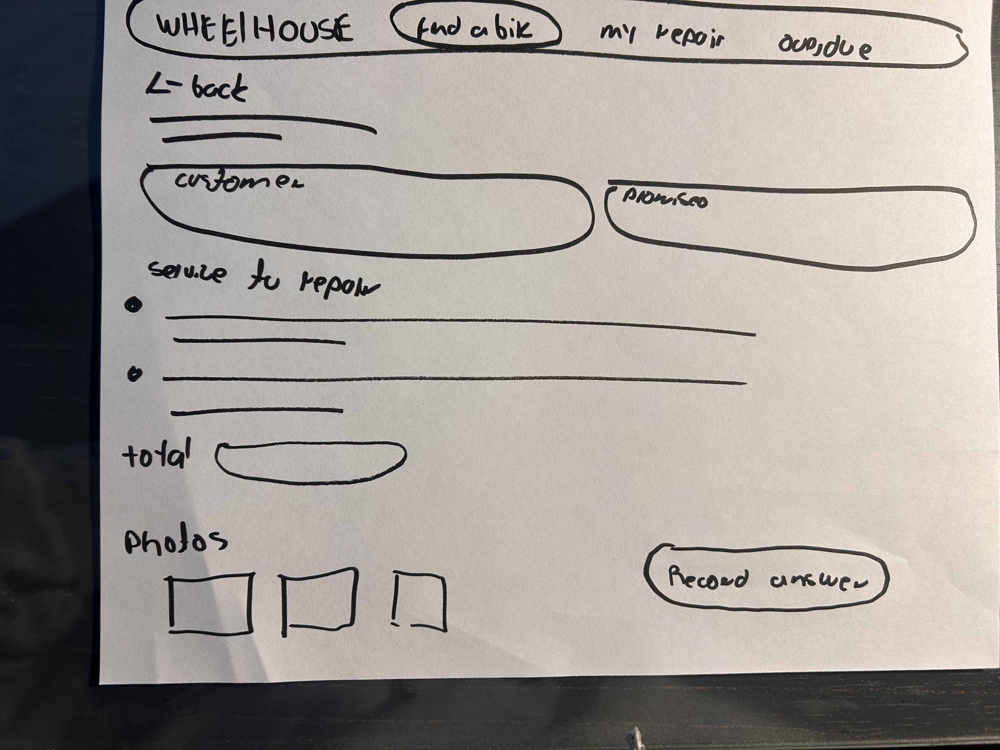
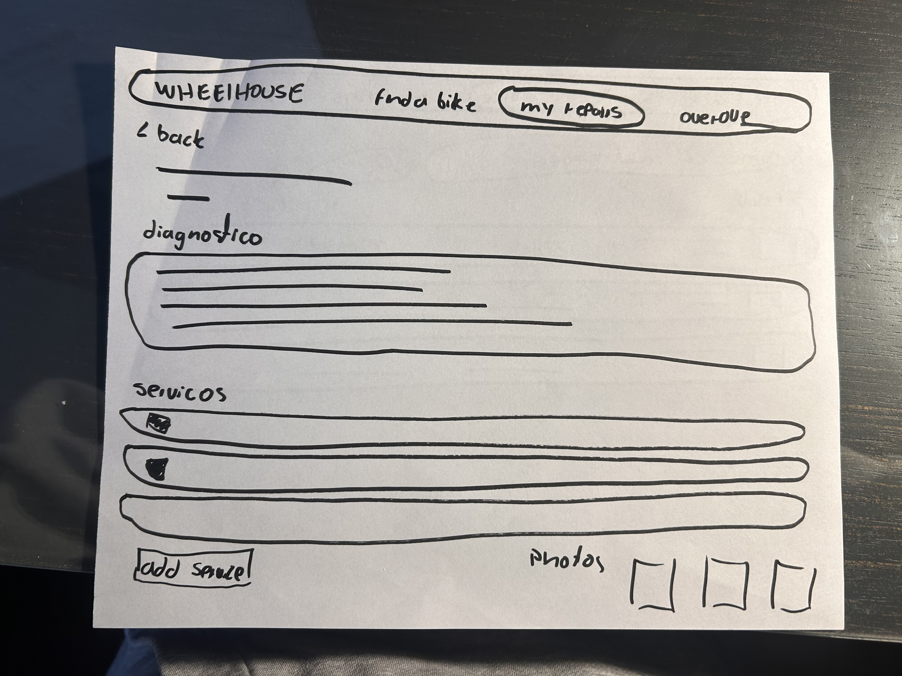
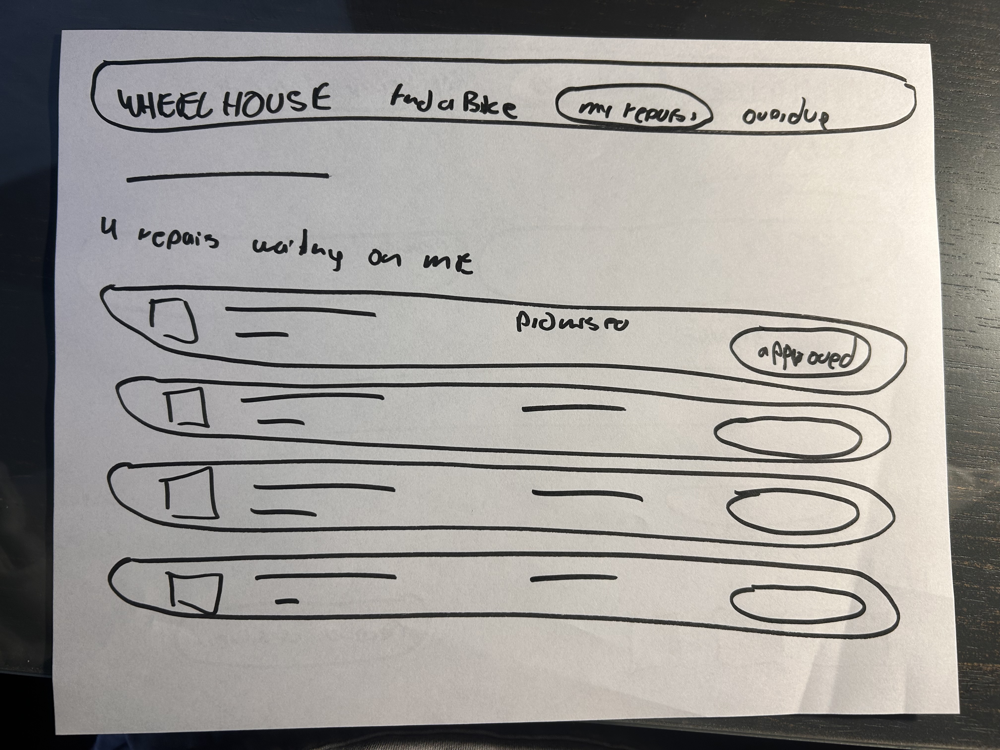
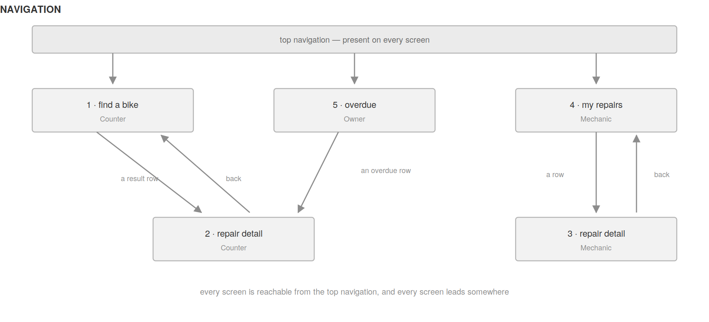

# Wireframes

Five screens, low fidelity on purpose. Colour, typography and finish are not part of what is being
decided here.

## 1 · Counter — find a bike

The screen the owner describes: *"whoever picks up the phone has to walk to the back and find
out."* US-03.

## 2 · Counter — repair detail

Role: **Counter**. US-04, US-05.

## 3 · Mechanic — repair detail

Role: **Mechanic**. The same repair as screen 2, drawn again because the two roles do not see the
same thing: the mechanic gets the diagnosis field and the service checkboxes, and does not get the
customer's phone number or the *mark collected* button. US-06, US-08, US-09.

## 4 · Mechanic — my repairs

Role: **Mechanic**. US-07.

## Navigation

